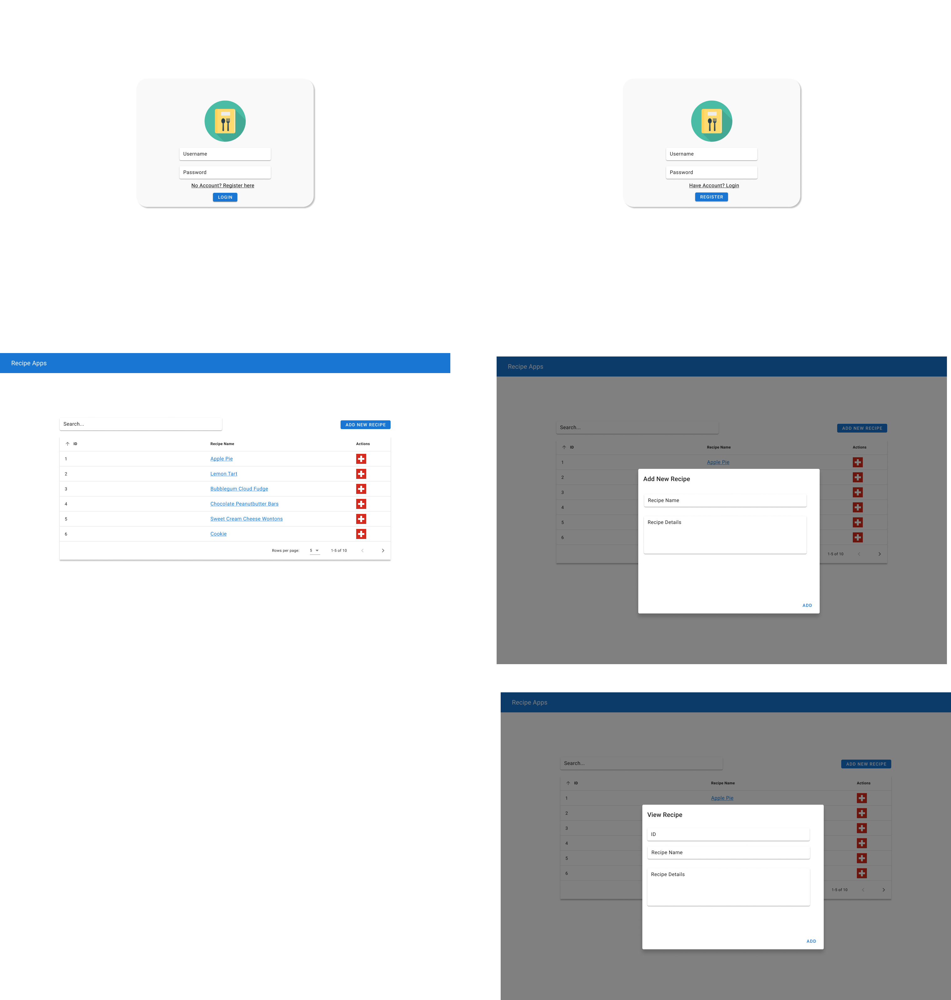

# Recipe Sharing App

This is a web application that allows users to create and share recipes. The application is built using React.js for the frontend , MaterialUI for the UI library and Firebase for user authentication, recipe storage, and recipe sharing. 

---
## Very First Step

1. Fork this repo in your own GitHub!!!!!!! 


## Installation
To install and run the application, follow these steps:

1. Clone this repository to your local machine.

2. In the project directory, create a new React.js project by running the following command in your terminal ```npx create-react-app recipe-sharing-app``` .

3. Change into the project directory by running ```cd recipe-sharing-app``` and run ```npm install @mui/material @emotion/react @emotion/styled firebase``` to install the necessary dependencies.

4. Create a Firebase account and set up a new project

5. In the Firebase console, enable email/password authentication and create a new Cloud Firestore database.

6. Copy the Firebase configuration object from the Firebase console and paste it into a new file named ```.env.local``` in the project directory. The object should look like this:


```javascript
REACT_APP_FIREBASE_API_KEY=your-api-key
REACT_APP_FIREBASE_AUTH_DOMAIN=your-auth-domain
REACT_APP_FIREBASE_PROJECT_ID=your-project-id
REACT_APP_FIREBASE_STORAGE_BUCKET=your-storage-bucket
REACT_APP_FIREBASE_MESSAGING_SENDER_ID=your-sender-id
REACT_APP_FIREBASE_APP_ID=your-app-id
```
Replace the ```your-``` placeholders with the corresponding values from your Firebase project.

6. Run npm start to start the application.
The application should now be running at ```http://localhost:3000```

## Requirements

To complete this task, you will need to implement the following features in the application:

1. User authentication: Users should be able to sign up and log in.

2. Recipe Adding: Users should be able to add a new recipe by filling out a form with the recipe's name, and recipe details.

3. Recipe listing: Users should be able to view a list of all the recipes that have been created by all users.

4. Recipe details: Users should be able to view the details of a specific recipe, and recipe's name, and recipe details.


### Sicne our product is close to this UI. Make sure your work following the image below to finish the task
\
\



After you completed the task, please commit and push to your Github and send us the repository url within 1 week.
